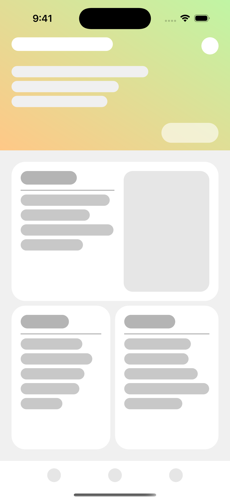

# tears

C++ UI library. Just write views, they are automatically layed out in that order.

## Usage

See the sample at `tears/MainScene.cpp`. If you want to run sample app, open `tears.xcodeproj` in Xcode and run.



## How to create a custom view

1. Create a class which inherit `View` class.
2. Add subview to the `CustomView` at the constructor or `viewWillLayout()`.

```cpp
#include "view/base/View.hpp"

class CustomView: public View {
protected:
    virtual void viewWillLayout() override {
        // add subview(s) here ...
        auto subview = make_unique<Rectangle>();
        addchild(move(subview));
    }
public:
    CustomView() {
        // or here.
        auto subview = make_unique<Circle>();
        addChild(move(subview));
    }
    virtual ~CustomView() {}
};
```

If you want to specify size, padding, alignment etc., use the methods in the `Modifier` class. Since `View` class inherits `Modifier` class, just call those methods from the `View` instances.

```cpp
auto customView = make_unique<CustomView>();
customView->setWidthRatio(0.5f) // width = 50%
            .setHeight(100.f) // height = 100dp
            .setPadding(EdgeVertical, 8.f) // padding top and bottom = 8dp
            .setAlignment(AlignmentTop); // aligned to top in the container
```

## Documents

Document page is not deployed yet but you can serve it on localhost.

```sh
pip install mkdocs-material
mkdocs serve
```
